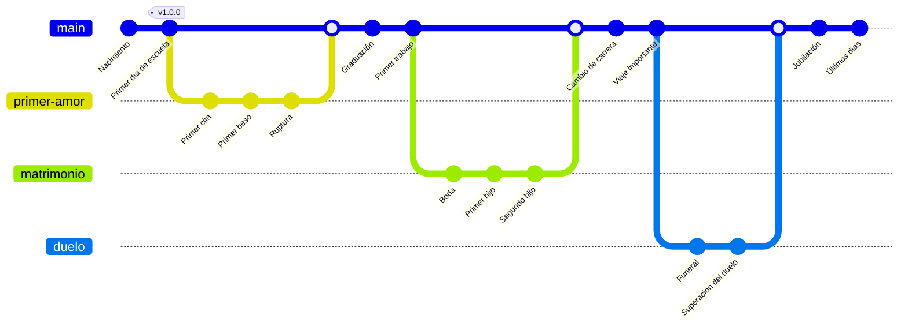

# Que es un VCS

Un VCS es un sistema que se usa para llevar un control de todos los cambios que se hagan en un proyecto de programación.

En general tiene su valor en proyectos cuyo contenido sean ficheros de texto.

Su mayor valor viene en el trabajo en grupo.

Sin un VCS el manejo de los cambios de un proyecto se combierte en un lio de carpetas y es inmanejable según suben los participantes en el proyecto y la complejidad del mismo.

# Tipos

Los diferencia donde se guarden los cambios, si se guardan en local todos los cambios o sólo se guardan en remoto

# Historia de vida en Git

Este es un ejemplo de cómo representar la vida de una persona usando Git y Mermaid.

